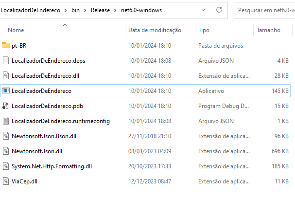

# Localizador de Endereço

Este é um aplicativo Windows Forms em .NET 6 e C# que permite localizar o CEP por meio do nome do logradouro, cidade e UF, bem como localizar os dados 
do endereço por meio do CEP.  

O aplicativo utiliza um ViaCep Clint do [guibranco](https://guibranco.github.io/ViaCEP/) que por sua vez acessa o WebService do [ViaCEP](https://viacep.com.br/) para realizar as pesquisas.

## Recursos

- **Localizar CEP por Logradouro, Cidade e UF:** Insira o nome do logradouro, cidade e UF nos campos apropriados e clique no botão "Pesquisar" para obter o CEP correspondente.

- **Localizar dados do endereço por CEP:** Insira o CEP desejado no campo apropriado e clique no botão "Pesquisar" para obter os dados do endereço correspondente.

## Pré-requisitos

- [.NET 6 SDK](https://dotnet.microsoft.com/download/dotnet/6.0)

## Como executar
 - Realizar o Download do projeto e dentro do diretorio \LocalizadorDeEndereco\bin\Release\net6.0-windows\ executar .exe LocalizadorDeEndereco

 

